# System Design: Unified Master Root Flow

## Overview
This document outlines the architecture for the Skill Intelligence Platform, designed to verified intelligence over resumes.

## Complete System Design Diagram

```mermaid
graph TD
    %% User Entry
    User([User Entry]) --> Landing[Landing System]
    
    subgraph "Landing System"
        ValueEngine[Value Engine]
        TrustBuilder[Trust Builder]
        ConvTrigger[Conversion Trigger]
    end
    
    Landing --> AuthRoot[Authentication Root]
    
    subgraph "Authentication Root"
        IdManager[Identity Manager]
        RoleClass[Role Classifier]
        SessControl[Session Controller]
    end
    
    AuthRoot --> shell[Protected Intelligence Shell]
    
    subgraph "Protected Intelligence Shell"
        direction TB
        subgraph "Student Intelligence Branch"
            DashEngine[Dashboard Engine]
            CodeArena[Coding Arena]
            AIAnalyzer[AI Analyzer / Moat]
            SkillDNA[Skill DNA System]
            AdaptBrain[Adaptive Learning Brain]
            AssessMod[Assessment Module]
            RewardEng[Reward Engine]
        end
        
        subgraph "Recruiter Intelligence Branch"
            TalentDash[Talent Dashboard]
            SkillFilter[Skill Filter Engine]
            CandView[Candidate Intelligence Viewer]
            ShortList[Shortlist Pipeline]
        end
        
        subgraph "Institution Intelligence Branch"
            AssessGen[Assessment Generator]
            StudMon[Student Monitor]
            PerfAnal[Performance Analytics]
        end
    end
    
    %% Relationships & Data Flow
    CodeArena -->|Raw Code Signals| AIAnalyzer
    AIAnalyzer -->|Cognitive Metrics| SkillDNA
    SkillDNA -->|Skill Identity| AdaptBrain
    AdaptBrain -->|Personalized Path| DashEngine
    
    SkillDNA -->|Verified Data| SkillFilter
    SkillDNA -->|Growth Curve| CandView
    
    AssessMod -->|Test Results| StudMon
    StudMon -->|Aggregated Data| PerfAnal
    
    %% Global Data Loop
    subgraph "Global Data Loop"
        SignalCap[Signal Capture]
        SkillModel[Skill Modeling]
        RecSys[Recommendation System]
        UserAct[User Activity]
    end
    
    UserAct --> SignalCap
    SignalCap --> SkillModel
    SkillModel --> RecSys
    RecSys --> UserAct
    
    %% Flywheel
    SkillDNA -.->|Better Hiring| RecruiterGrowth
    RecruiterGrowth -.->|More Opportunities| StudentGrowth
    StudentGrowth -.->|More Data| SkillDNA
```

## Core Components Breakdown

### 1. Landing System
*   **Value Engine**: Explains transformation from resume-based to skill-based.
*   **Trust Builder**: Establishes institutional credibility.
*   **Conversion Trigger**: Pushes users to "Start Skill Evaluation".

### 2. Authentication Root
*   **Identity Manager**: Handles signup/login/encryption.
*   **Role Classifier**: Segregates Students, Recruiters, and Institutions.
*   **Session Controller**: Manages tokens and session persistence.

### 3. Student Intelligence Branch (Core Engine)
*   **AI Analyzer**: Analyzes logic, style, and algorithms (not just correctness).
*   **Skill DNA System**: Creates a "developer credit score" based on logic, patterns, and growth.
*   **Adaptive Learning Brain**: Personalizes the learning journey based on mastery zones.
*   **Coding Arena**: The interface for code execution and signal capture.

### 4. Recruiter Intelligence Branch
*   **Talent Dashboard**: High-signal overview of talent clusters.
*   **Skill Filter Engine**: Filters candidates by logic score and pattern mastery.
*   **Candidate Intelligence Viewer**: Shows verified capability and trajectory.

### 5. Institution Intelligence Branch
*   **Assessment Generator**: AI-driven exam creation.
*   **Performance Analytics**: Class averages and knowledge gaps.

## Data Flow & Flywheel
The system improves with use. More student activity generates more data, improving the Skill DNA accuracy, which attracts more recruiters, leading to more opportunities and thus more students.
